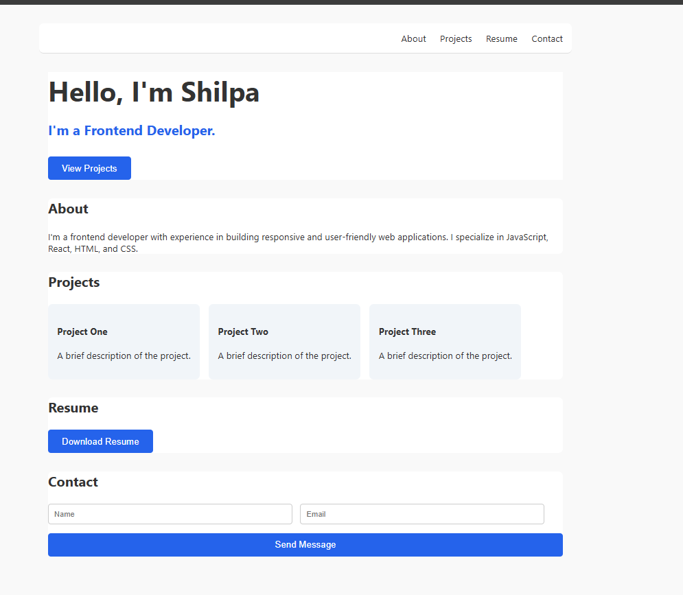

# Resume Website

This project is a simple **personal portfolio / resume website** built using **HTML and CSS**.

The website presents personal information, skills, projects, and contact details in a clean and structured layout.

The goal of this project was to practice building a **basic portfolio layout using frontend technologies**.

---

## Technologies Used

- HTML5
- CSS3

---

## Features

- Navigation bar with smooth scrolling
- Hero introduction section
- About section
- Skills section
- Projects showcase
- Resume download button
- Contact form layout
- Clean and responsive design

---

## Project Preview

(Add screenshot of the webpage here)

Example:

---

## How to Run the Project

1. Download or clone the repository
2. Open the project folder
3. Open `index.html` in your browser

The webpage will display the personal resume website.

---

## Project Structure
